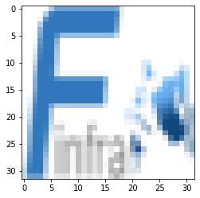
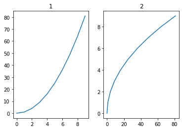

# Snippet


## Base Import


```python
from matplotlib.pyplot import imread,imshow,subplots,axis

```

## Read show


```python
%matplotlib inline
from matplotlib.pyplot import imread,imshow,subplots
i=imread('http://finfra.com/f/f.png')
imshow(i)
```


    

    


## Subplot


```python
fig, ax = subplots(nrows=1, ncols=2, figsize=(15, 7), dpi=80, sharex=True, sharey=True)

img = imread('http://finfra.com/f/f.png')
ax[0].axis("on")
ax[0].imshow(img, cmap='gray')


img2 = imread(  'http://finfra.com/f/finfra.png')
ax[1].axis("off")
ax[1].imshow(img2, cmap='gray')

```


    

    


```python

```


```python

```


```python

```

# matplotlib
## Usage1 : Simple Example 


```python
%matplotlib inline
import matplotlib.pyplot as plt
x = range(100)
y = [ i*i for i in x]
plt.plot(x,y)
plt.show()
```

## Usage2 
* Wikidocs Matplotlib : https://wikidocs.net/book/1634
 


```python
import matplotlib.pyplot as plt
import numpy
train_X = numpy.asarray([3.3,4.4,5.5,6.71,6.93,4.168,9.779,6.182,7.59,2.167,
                         7.042,10.791,5.313,7.997,5.654,9.27,3.1])
train_Y = numpy.asarray([1.7,2.76,2.09,3.19,1.694,1.573,3.366,2.596,2.53,1.221,
                         2.827,3.465,1.65,2.904,2.42,2.94,1.3])
plt.plot(train_X, train_Y, 'ro', label='Original data')
plt.plot(train_X, 0.228853 * train_X + 0.950674, label='Fitted line')
#plt.legend()
plt.show()
```

## Subplot
* Simple


```python
%matplotlib inline
import matplotlib.pyplot as plt

x=range(10)
y=[i*i for i in x]

fig = plt.figure()
subplot = fig.add_subplot(1, 2, 1)
subplot.set_title('1')
subplot.plot(x,y)
subplot = fig.add_subplot(1, 2, 2)
subplot.set_title('2')
subplot.plot(y,x)
```


    

    


## With For


```python
import matplotlib
# plt.rc('font', family='NanumGothicCoding')
matplotlib.rcParams['axes.unicode_minus'] = False

x=range(100)
fig = plt.figure()
for i in range(2):
    for j in range(4):
        subplot = fig.add_subplot(2, 4, i*4+j + 1)
        subplot.set_title(f'{i},{j}')
        subplot.plot(x,[ (ii**(j+1)) * (i-0.5)   for ii in x ])
```

## subplot with image Array


```python
import numpy as np
import matplotlib.pyplot as plt

# Genera)
plt.show()
```


```python
import numpy as np
import matplotlib.pyplot as plt

# Generate random data
data = np.random.rand(100)

# Plot in different subplots
fig, ax = plt.subplots(1, 2)
ax[0].plot(data)

ax[1].plot(data)

ax[0].plot(data+1)

plt.show()
```


```python
fig = plt.figure()
from matplotlib.pyplot import imread
img=imread('f.png')
imgs=[img,img,img,
      img,img,img]

fig, ax = plt.subplots(2, 3)
for i in range(2):
    for j in range(3):
        ax[i][j].set_xticks([])
        ax[i][j].set_yticks([])
        ax[i][j].imshow(imgs[i*2+j])        
plt.show()        
```


    

    


```python
# !pip install imgaug

import imgaug as ia

ia.imshow(ia.draw_grid(imgs, cols=3, rows=2))


```
