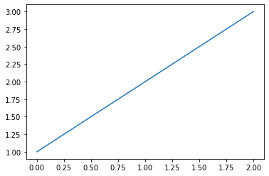

# Matplot Graphs
* References : [ Matplotlib Tutorial - 파이썬으로 데이터 시각화 하기 ](https://wikidocs.net/92071)

## X값으로 그래프 그리기


```python
%matplotlib inline
import matplotlib.pyplot as plt

plt.plot([2, 3, 5, 10])
plt.show()

```

## Y값으로 그래프 그리기


```python
import matplotlib.pyplot as plt

plt.plot([1, 2, 3, 4], [2, 3, 5, 10])
plt.show()

```

## 여러 개의 그래프 그리기


```python
%matplotlib inline
import matplotlib.pyplot as plt
import numpy as np

# 200ms 간격으로 균일하게 샘플된 시간
t = np.arange(0., 5., 0.2)

# 빨간 대쉬, 파란 사각형, 녹색 삼각형
plt.plot(t, t, 'r--', t, t**2, 'bs', t, t**3, 'g^')
plt.show()
```

# Graph Save


```python
import matplotlib.pyplot as plt
import matplotlib
matplotlib.use('Agg')

plt.plot([1,2,3])
plt.savefig('/tmp/a.png')
!ls /tmp/a.png
```


    

    

