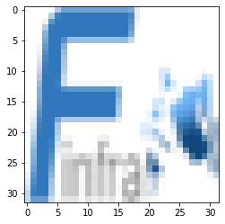

# Font문제

## Minus 폰트 깨짐 문제 해결


```python
import matplotlib
matplotlib.rcParams['axes.unicode_minus'] = False
```

## 한글 사용


```python
import matplotlib.pyplot as plt
x = range(100)
y = [ i*i for i in x]
plt.rcParams["font.family"] = "NanumGothicCoding"
plt.plot(x,y)
plt.xlabel('엑스')
plt.ylabel('Probability')
plt.show()
```

or
* 설치된 폰트의 이름을 알 때


```python
plt.rc('font', family='Nanum Gothic Coding')
```

or
* Font파일 위치는 아는데 이름은 모를때


```python
from matplotlib import font_manager
font_path="/usr/share/fonts/truetype/nanum/NanumGothicCoding.ttf"
font_name = font_manager.FontProperties(fname=font_path).get_name()
plt.rc('font', family=font_name)
```

## OpenCV와 헷갈리지 말자


```python
import cv2
from matplotlib.pyplot import imshow,axis,imread

from os.path import join,isfile,isdir
import pandas as pd
url = 'http://finfra.com/f/f.png'
dPath='/tmp/f.png'  
if not isfile(dPath) :
    !wget -O{dPath} {url} 
    
    
    
img = cv2.imread(dPath)
img2=cv2.cvtColor(img, cv2.COLOR_BGR2RGB)
axis("off")
imshow(img2)
# cv2.imshow("f.png",img2)
# cv2.waitKey(0)
# cv2.destroyAllWindows()
```


    <matplotlib.image.AxesImage at 0x7fc83c7c14d0>


    

    


### Cf) matplot 방식에서 읽으면 배경이 희다. 


```python
%matplotlib inline
from matplotlib.pyplot import imread,imshow,subplots
i=imread('/tmp/f.png')
imshow(i)
```


    

    


```python

```
