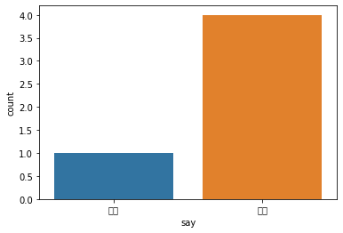

# Pandas Data
Pandas 를 이용해 Data 를 가공하는 법을 알아봅니다.

## Import
보통 pd 로 많이 사용합니다.


```python
import pandas as pd
```

version 확인


```python
pd.__version__
```

## Data 를 가져오기


### 데이터 다운로드


```python
!wget -O/tmp/example.csv https://github.com/Finfra/TensorflowStudyExample/raw/master/data/example.csv
```

### 구글 드라이브를 더 잘 붙어 있게 해주는 방법


```python
from google.colab import drive
isMount=!df |grep /content/drive
if len(isMount) < 1 : drive.mount('/content/drive', force_remount=False)
```

%cd 로 움직여서 해당 Path 위치에 있도록 도와준다.


```python
# %cd /gdrive/My Drive/PracticeProject/1st_MLP_easy
# !ls
```

### CSV 데이터 읽어오기


```python
df = pd.read_csv("/tmp/example.csv")
df
```

## Excell 데이터 읽어오기


```python
!pip3 install xlrd
```


```python
i_cols=['a','b','c','d','e']
# pd.read_excel('./example_data/example.xlsx')
pd.read_excel('https://github.com/Finfra/TensorflowStudyExample/raw/master/data/example.xlsx')
```

## Data 분석하기

### countplot
답변 갯수가 불균형적이거나 하는 것을 찾을 때 쓰면 좋다.<BR>


```python
import matplotlib.pyplot as plt
from lightgbm import LGBMClassifier
import seaborn as sns
from sklearn.metrics import roc_auc_score
```


```python
financial = pd.read_csv("/tmp/example.csv")
add_col = ['좋아', '싫어', '싫어','싫어', '싫어']
financial['say'] = add_col
financial
```


```python
print(financial["say"].value_counts())
sns.countplot(financial["say"])
```

    /usr/local/lib/python3.7/dist-packages/seaborn/_decorators.py:43: FutureWarning: Pass the following variable as a keyword arg: x. From version 0.12, the only valid positional argument will be `data`, and passing other arguments without an explicit keyword will result in an error or misinterpretation.
      FutureWarning


    <matplotlib.axes._subplots.AxesSubplot at 0x7f71a42d6390>


    /usr/local/lib/python3.7/dist-packages/matplotlib/backends/backend_agg.py:214: RuntimeWarning: Glyph 51339 missing from current font.
      font.set_text(s, 0.0, flags=flags)
    /usr/local/lib/python3.7/dist-packages/matplotlib/backends/backend_agg.py:214: RuntimeWarning: Glyph 50500 missing from current font.
      font.set_text(s, 0.0, flags=flags)
    /usr/local/lib/python3.7/dist-packages/matplotlib/backends/backend_agg.py:214: RuntimeWarning: Glyph 49899 missing from current font.
      font.set_text(s, 0.0, flags=flags)
    /usr/local/lib/python3.7/dist-packages/matplotlib/backends/backend_agg.py:214: RuntimeWarning: Glyph 50612 missing from current font.
      font.set_text(s, 0.0, flags=flags)
    /usr/local/lib/python3.7/dist-packages/matplotlib/backends/backend_agg.py:183: RuntimeWarning: Glyph 51339 missing from current font.
      font.set_text(s, 0, flags=flags)
    /usr/local/lib/python3.7/dist-packages/matplotlib/backends/backend_agg.py:183: RuntimeWarning: Glyph 50500 missing from current font.
      font.set_text(s, 0, flags=flags)
    /usr/local/lib/python3.7/dist-packages/matplotlib/backends/backend_agg.py:183: RuntimeWarning: Glyph 49899 missing from current font.
      font.set_text(s, 0, flags=flags)
    /usr/local/lib/python3.7/dist-packages/matplotlib/backends/backend_agg.py:183: RuntimeWarning: Glyph 50612 missing from current font.
      font.set_text(s, 0, flags=flags)


    

    


## Data 를 가공하기

### 특정조건으로 데이터를 정렬하기


```python
df.sort_values(by=["d"])
```

### DROP 을 통해 데이터 없애기
inplace 옵션을 True 를 주면 자체 데이터에 바로 영향을 주고 False 를 하게 되면 해당 데이터에는 영향을 미치지 않는다.<BR>
(False 로 하고 다른 Dataframe 에 담는 것을 추천한다.)


```python
drop_df = df.drop(['e'], axis=1, inplace=False)
drop_df
```

### 열 추가하기


```python
add_col = ['좋아', '가는', '거야','신나', '좋아']
df['say'] = add_col
df
```

### 행 추가하기

append 를 이용한 행 데이터 추가<BR>
(Index 가 간혹 int 형태로 들어가서 깨지는 경우가 있다.)


```python
new_data = {'a':2, 'b' : 3, 'c' : 4, 'd' : 8, 'e' : 3, 'say' : '슬퍼'}
ef = df.append(new_data, ignore_index=True)
ef
```

아예 index를 지정한 데이터를 추가하는 방법이 있다.<BR>
(중복되는 index가 생겨날 수 있으니 주의해야 한다.)


```python
ihave = [(4,5,3,4,2,'슬퍼')]
new_data = pd.DataFrame(ihave, columns=df.columns, index=[5])
ef = df.append(new_data)
ef
```

loc 을 이용한 추가<BR>
(Index 를 내가 지정하기 때문에 위와 마찬가지로 깨지지 않게 해줄 수 있다. 다만, 원래 존재하는 키를 지정하는 경우 업데이트가 되므로 주의가 필요하다.)


```python
df.loc[8]=[2, 3, 4, 8, 3, '이나']
df
```

### Merge
Merge 함수를 통해 DBMS 의 Join 과 같은 효과를 가져올 수 있다.


```python
df1 = pd.DataFrame([["a","잘함","잘함"],["b","잘함","못함"],["c","못함","잘함"]], columns = ["이름","축구","농구"])
df1
```


```python
df2 = pd.DataFrame([["a","잘함"],["b","못함"],["d","잘함"]], columns = ["이름","배구"])
df2
```

#### Inner


```python
pd.merge( left = df1, right = df2, how = "inner", on = "이름")
```

#### Left


```python
pd.merge(left = df1, right = df2, how = "left", on = "이름")
```

#### Right


```python
pd.merge(left = df1, right = df2, how = "right", on = "이름")
```

#### Outer


```python
pd.merge(left = df1, right = df2, how = "outer", on = "이름")
```

#### Index 를 기준으로 합치기


```python
df1 = df1.set_index("이름")
df2 = df2.set_index("이름")
df2
```


```python
pd.merge(left=df1, right=df2, left_index=True, right_index=True, how = "inner")
```


```python
pd.concat([df1,df2],axis =1, join="inner")
```

### Concat
여러개의 동일한 형태의 dataframe 을 합쳐준다.


```python
fi1 = pd.DataFrame([["A0","잘함","잘함","못함"],
                    ["A1","잘함","못함", "잘함"],
                    ["A2","못함","잘함", "못함"]]
                   , columns = ["fi1","fi2","fi3","fi4"])
fi2 = pd.DataFrame({'fi1': ['A3', 'A4', 'A5'],
                    'fi2': ['B3', 'B4', 'B5'],
                    'fi3': ['C3', 'C4', 'C5'],
                    'fi4': ['D3', 'D4', 'D5']},
                   index=[3, 4, 5])
```


```python
financial = pd.concat([fi1,fi2],axis=0, join='inner')
financial
```

### 셔플링
sample 함수를 이용한 셔플링 방법. 간혹 인덱스가 꼬여 있으면 자료를 못 읽거나 이상하게 받아들일 수 있으므로 rest_index 를 꼭해줘야 한다.


```python
financial = financial.sample(frac=1)
financial
```


```python
financial = financial.reset_index(drop=True)
financial
```

### replace
pandas 데이터를 받아들일 때 float 형태여야 하기 때문에 글자 형태인 것을 바꿔준다.


```python
financial = pd.read_csv("/tmp/example.csv")
add_col = ['좋아', '싫어', '싫어','싫어', '좋아']
financial['say'] = add_col
financial['say'].unique()
```


```python
change_dict3 = {'좋아': 1., '싫어': 0.}
financial = financial.replace({"say" : change_dict3})
financial
```

### One hot encoding
1, 3, 4, 6, 7, 8 이런 식의 숫자가 반복된다면 그것의 강도를 머신이 정확히 알 수 없을 수 있다. 그래서 one hot encoding 을 통해 정확하게 만들어준다.


```python
financial["d"].unique()
```


```python
from sklearn.preprocessing import OneHotEncoder
enc = OneHotEncoder(handle_unknown='ignore')
# enc.fit(.reshqpe(-1,1))
temp2 = pd.get_dummies(financial["d"])
temp2
```


```python
financial = pd.concat([financial,temp2],axis=1, join='inner')
financial
```


```python
financial = financial.drop(["d"], axis=1, inplace=False)
financial
```

## Correlation
[Pearson Correlation Coefficient](https://en.wikipedia.org/wiki/Pearson_correlation_coefficient)를 구할 수 있는 corr(), corrwith() 함수를 제공합니다. 이들 함수를 groupby() 와 apply(lambda func)를 함께 사용함으로써 그룹 별 변수 간 상관계수를 구할 수 있습니다. 

출처:  [R, Python 분석과 프로그래밍의 친구 (by R Friend)](https://rfriend.tistory.com/405)


```python
lst = [[1,2,3,4,5,6,7],
        [10,15,20,25,50,55,60],
        [0,0,0,0,0,0,0],
        [-1,-20,-30,-45,-50,-55,-70]]

df = pd.DataFrame(lst).T
corr = df.corr(method = 'pearson')
print(corr)

print(corr.index[abs(corr[3])>=0.45])
```

## Normalization
데이터가 가진 feature의 스케일이 심하게 차이가 나는 경우 문제가 되기 때문에 모든 데이터 포인트가 동일한 정도의 스케일(중요도)로 반영되도록 해주는 게 정규화(Normalization)의 목표이다.

출처. [아무튼 워라벨](http://hleecaster.com/ml-normalization-concept/)

### Basic


```python
def norm(x):
  _max = x.max()
  _min = x.min()
  _denom = _max - _min
  return (x - _min) / _denom
```

### Pandas


```python
from sklearn.preprocessing import MinMaxScaler
lst = [[1,2,3,4,5,6,7],
        [10,15,20,25,50,55,60],
        [0,0,0,0,0,0,0],
        [-1,-20,-30,-45,-50,-55,-70]]
df = lst
min_max_scaler = MinMaxScaler()
fitted = min_max_scaler.fit(df)
print(fitted.data_max_, fitted.data_min_)

output = min_max_scaler.transform(df)
print(output)
```


```python

```
